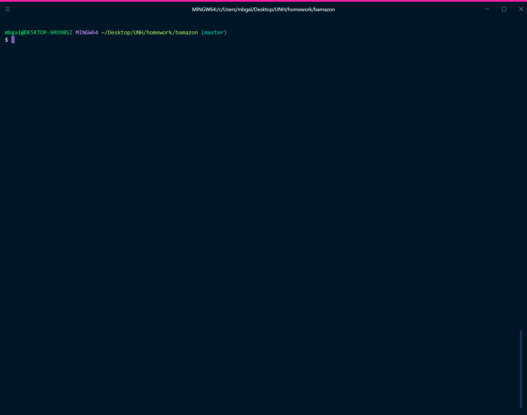
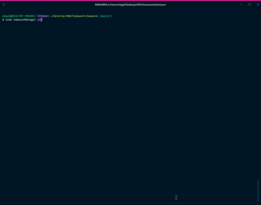
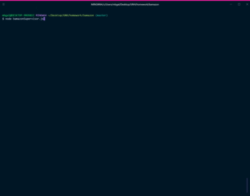

# bamazon  
A CLI based e-commerce website developed with Node.js and MySQL  

## Overview  
Bamazon is an Amazon-like storefront developed in node and leveraging a MySQL backend. The app takes orders from customers and depletes stock from the store's inventory. The bonus features track product sales across the store's departments and  provides a summary of the highest-grossing departments in the store  

__Command line syntax:__   
Bamazon supports the follow commands and yields the corresponding content:  
  
|       | Command           | Result                                       |
| ----- | ----------------- | -------------------------------------------- |
| __1__ | node bamazonCustomer.js | Customer Portal to view and purchase products from the online store |
| __2__ | node bamazonManager.js  | Manager Portal to check inventory, add stock, and add new products  |
| __3__ | node bamazonSupervisor.js  | Supervisor Portal to check department finances and add new departments |

### Demonstration of Functionality  
  
Each of the videos provides an example of to use each of the applications:  
  
__1) Bamazon Customer Portal__     
  Video file to demontrate the Bamazon Customer application (displays inventory and a sample purchase)   
  
  
__2) Bonus Feature - Bamazon Manager Portal__    
  Video file to demontrate the Department Manager application  (displays department view, low inventory, adding stock and adding new products)  
  
   
__3) Bonus Feature - Bamazon Supervisor Portal__  
  Video file to demontrate the overall Supervisor's application  (displays department finances, adds a new department, shows the department view in the manager portal and adds a product to the new department, demonstrates a customer purchase of that new product.  Closes with the supervisors financial view of that new department sales )  
  
  
### Developer notes  
- **.env:**  environment variables used by dotenv package holding secret keys and passwords for mySQL, not included in GIT  
- **keys.js:**  Module exporting the client keys and passwords  
- **bamazonCustomer.js:** display logic and SQL code for the Customer Portal   
- **bamazonManager.js:** display logic and SQL code for the Department Manager Portal   
- **bamazonSupervisor.js:** display logic and SQL code for the Supervisor Portal  
 
 ### How to install/run the application  
1. Download and install the latest version of Node.js following the website instructions for your platform  
   ` https://nodejs.org/en/download/`   
2. Clone this repository into a clean diretory  
   `$ git clone <repository url>`  
3. Bring down the latest package dependencies using node package manager  
   `npm install`  
4. Download and install the latest version of mySQL  
   ` https://www.mysql.com/downloads/`   
5. Execute the schemas.sql from the scripts directory in MySQLWorkbench to create the tables and populate some sample data  
6. Run a command manuallly from the command line  
   `node bamazonCustomer.js`  
  
### Technology Used  
    
| Package/Interface | Version     | Description                                                              |
| ----------------- | ----------- | ------------------------------------------------------------------------ |
| Node.js           | __11.1.0__  | Main javascript engine for this application                              |
| npm mySQL         | __2.16.0__  | mySQL relational database management system & workbench                  |
| npm Inquirer      | __6.2.0__   | Library to handle the command line prompting                             |
| npm dotenv        | __6.2.0__   | Utility package to hide the secret keys in a .env file and away from git |
| npm cli-table     | __0.3.1__   | Command line interface utility                                           |
| colors            | __1.3.2__   | String package to manage ascii text color                                |

## Authors  
Michael Galarneau - Initial work - five0ffour  
December, 2018  

# Acknowledgements  
Cli-tables - ascii text table formatting tool, provides UI sizzle  
Colors - ascii text color tool, more UI sizzle  
DotEnv - environment variables management tool  
Inquirer - command line interface tool  
mySql - the ubiquitous relational database management system  
